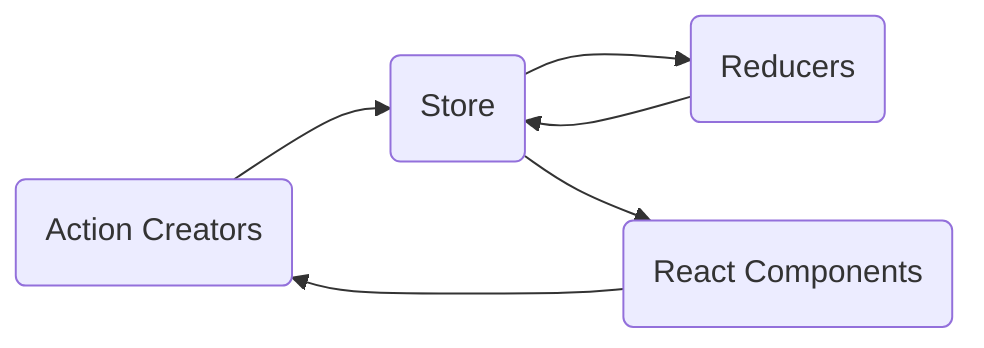

Qual problema Redux tenta resolver?
Quando e Onde utilizar?
Conceito de Redux
Diagrama de fluxo do Redux


# Redux
[https://redux.js.org/basics/usage-with-react/](https://redux.js.org/basics/usage-with-react/)

Qual problema Redux tenta resolver?
Quando e Onde utilizar?
Conceito de Redux
Diagrama de fluxo do Redux

Criar Store
Criar Actions/ Reducers
Conectar Component
Integrar com service

## Store
```js
import { createStore } from  'redux'
import  profile  from  './profile'
export  default  createStore(profile)
```

## Reducer
```js
const initialState = {
  profiles: [],
}

function ProfilesReducer(state = initialState, action) {
  switch (action.type) {
    case 'SET_PROFILES':
      return {
        ...state,
        profiles: action.profiles,
      }
    case 'LOGOUT':
      return {
        ...state,
        profiles: initialState.profiles,
      }
    default:
      return state
  }
}

export default ProfilesReducer

```

## Provider
```js
/* eslint-disable react/jsx-filename-extension */

import  React  from  'react'
import { Provider } from  'react-redux'
import { HomeScreen } from  'screens'
import  store  from  './src/store/createStore'

export  default  class  App  extends  React.Component {

	render() {
		return (
			<Provider  store={store}>
				<AppContainer  />
			</Provider>

	)}
}
```
Fluxo Redux:




Criar Store
Criar Actions/ Reducers
Conectar Component
Integrar com service
